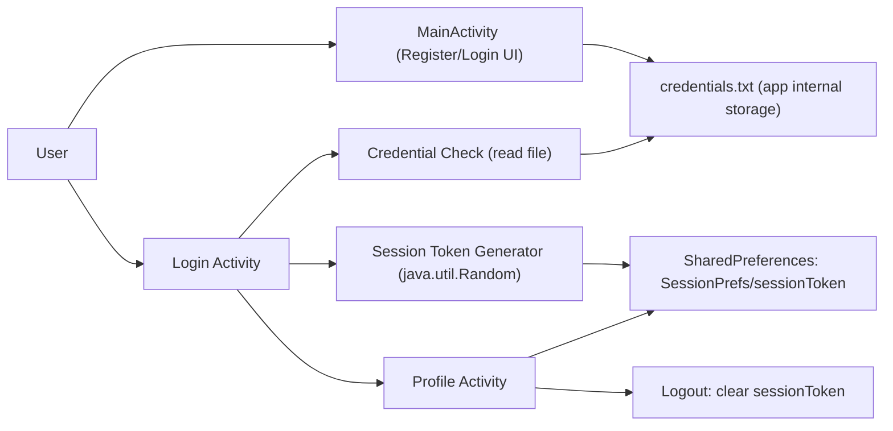

# INFO5995 Assignment 1 Draft (Case 1 APK)

## Scope
This draft covers the APK analysis tasks for `a1_case1.apk` using static reverse engineering (JADX). It maps directly to the assignment rubric and provides evidence references.

## Task 1: Unpack and Decompile APK
### What is an APK and why decompile it?
An APK (Android Package Kit) is the installable file format for Android apps. It bundles compiled bytecode (`classes.dex`), app resources (layouts/strings), and configuration such as `AndroidManifest.xml`. For security auditing, decompilation is required because we need human-readable code and resource files to inspect authentication logic, token generation, data storage, and security controls.

### AI-assisted tooling workflow (step-by-step summary)
1. Checked available local tools: `jadx`, `apktool`, `aapt` were not installed.
2. Downloaded a portable JADX release into `Assignment1/tools/`.
3. Ran JADX CLI to decompile `a1_case1.apk` into `Assignment1/decompiled/`.
4. Inspected manifest and Java classes for login/session behavior and random-value generation.

### Evidence from decompilation
- Package name: `com.example.mastg_test0016`  
  Evidence: `resources/AndroidManifest.xml` line 7
- Main activity: `com.example.mastg_test0016.MainActivity` with `MAIN/LAUNCHER` intent filter  
  Evidence: `resources/AndroidManifest.xml` lines 35-41
- Login activity found: `com.example.mastg_test0016.Login`  
  Evidence: `resources/AndroidManifest.xml` lines 31-34, `sources/com/example/mastg_test0016/Login.java`
- Profile activity found: `com.example.mastg_test0016.Profile`  
  Evidence: `resources/AndroidManifest.xml` lines 28-30, `sources/com/example/mastg_test0016/Profile.java`
- Decompiled class screenshot artifact (token generation snippet):  
  `Assignment1/submission_draft/evidence/login_generateSessionToken_snippet.png`

## Task 2: App Understanding and Simple Model
### App purpose summary (3-5 sentences)
This app is a deliberately insecure training sample (`MASTG-TEST0016`) focused on session randomness weaknesses. Users can register credentials in the main screen, which are saved to a local file, then log in on a second screen. On successful login, the app creates a session token and stores it in `SharedPreferences`. A profile screen allows logout by removing the stored token. The app appears local-only (no explicit network/API client logic in the app code).

### System model


### Key assets and data flows
- Credentials (`username/password`) saved to `credentials.txt`.
- Session token (`sessionToken`) saved to `SessionPrefs`.
- Login flow: user input -> credential file validation -> token generation -> token persistence -> profile transition.

### Core assumptions and attacker goals
- Assumptions:
  - Attacker can inspect app package and decompile code.
  - Attacker can observe login timing and may read or intercept app-generated tokens in a realistic deployment.
  - App has no strong server-side protection shown in this APK.
- Attacker goals:
  - Predict or reproduce session tokens.
  - Hijack or impersonate a user session where token acts as authentication proof.

## Task 3: Randomness/Crypto Vulnerability Discovery
### Random-like value inventory

| Location | Generator/API | Security role | Assessment |
|---|---|---|---|
| `MainActivity.randomNumberGenerator()` | `new Random().nextInt(100)` | UI/demo/debug style random value | Non-security use |
| `Login.generateSessionToken()` | `new Random()` + `nextInt(62)` over alphanumeric alphabet (16 chars) | Session token used in auth/session state | Security-sensitive and weak |

### Core vulnerability selected
`Login.generateSessionToken()` uses `java.util.Random` for session token generation (`Login.java` lines 183-189). `java.util.Random` is not cryptographically secure and is deterministic, making it unsuitable for authentication/session tokens.

## Task 4: What Went Wrong + Threat Model
### Where it is generated
- `createSession()` stores generated token in `SharedPreferences`  
  Evidence: `Login.java` lines 174-177
- Token generation logic uses `java.util.Random`  
  Evidence: `Login.java` lines 183-189

### Why method is unsuitable
Session tokens must be unpredictable. `java.util.Random` is a deterministic PRNG designed for simulations/general use, not adversarial settings. A motivated attacker with partial seed/state knowledge, repeated observations, or side-channel timing can reduce uncertainty and predict candidate outputs more effectively than with a CSPRNG.

### Realistic attacker model
- Reverse engineer attacker: decompiles APK and learns exact token algorithm/alphabet/length.
- Local-device attacker (rooted/debuggable/hooked environment): can observe token lifecycle in app storage or runtime.
- Observer attacker in a broader deployment: can correlate login events and observed tokens, then attempt prediction/replay.

### Step-by-step attack scenario
1. Attacker decompiles APK and confirms token algorithm: 16 chars from `[A-Za-z0-9]` using `Random.nextInt(62)`.
2. Attacker captures one valid session token or observes token generation moment (e.g., via local compromise/hook/logging in test setup).
3. Attacker reproduces candidate `Random` outputs around expected seed/state conditions to recover plausible token stream.
4. Attacker uses predicted/reproduced token values to impersonate a user session where token trust is enforced.

## Task 5: Write-up Material (for USENIX 2-page report)
### Suggested structure for final report
1. Introduction: APK analysis goal and why reverse engineering is required.
2. System/Threat model: components, assets, data flows, attacker capabilities.
3. Discovery method: JADX + targeted search for random/token/session code paths.
4. Vulnerability details: insecure session token generation using `java.util.Random`.
5. Mitigation: secure token generation and safer storage/validation.

### Mitigation proposal
- Replace `java.util.Random` with `java.security.SecureRandom`.
- Use at least 128-bit token entropy (e.g., 16 raw random bytes, Base64URL-encoded).
- Rotate token at each login and invalidate robustly on logout/session expiry.
- If used in real auth, enforce server-side session validation and expiry.

### Example secure replacement (Java)
```java
import java.security.SecureRandom;
import java.util.Base64;

private static final SecureRandom SECURE_RANDOM = new SecureRandom();

private String generateSessionToken() {
    byte[] bytes = new byte[16]; // 128-bit
    SECURE_RANDOM.nextBytes(bytes);
    return Base64.getUrlEncoder().withoutPadding().encodeToString(bytes);
}
```

## Additional observation (non-core)
Credentials are stored in plaintext style format in app-internal file `credentials.txt` via:
- `MainActivity.saveCredentialsToFile(...)` (`MainActivity.java` lines 54-61)

This is not the rubric's primary intended issue, but it is still a security weakness worth briefly noting.

### Extended findings from deeper pass
An additional deep audit identified more weaknesses worth mentioning in discussion/Q&A:
- Account-collision flaw from append-based registration + any-match login logic.
- Session token is stored but not actually enforced before profile access logic.
- Session/auth behavior leakage through debug logging.

Detailed evidence: `Assignment1/submission_draft/deep-findings.md`

## Analysis limitations
- Static analysis only; app runtime was not executed in an emulator/device during this draft.
- Some decompilation warnings exist due obfuscation/bytecode reconstruction limits, but key auth/session logic was recovered clearly.
