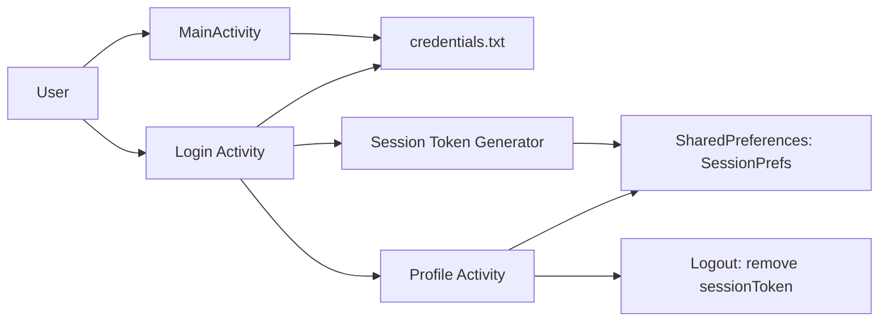

# Task 1 and Task 2 Draft

This draft covers the first two assignment tasks for `a1_case1.apk` using the current spec.

## Task 1: Unpack and Decompile the APK

### What an APK is and why decompilation is needed
An APK is the packaged file format used to install Android applications. It contains the app's compiled code, resources such as layouts and strings, and configuration files such as the Android manifest. For auditing, decompilation is necessary because the APK does not ship in a form that is easy for humans to inspect. Reverse engineering turns the package into readable source and resource files so that we can examine authentication logic, storage behavior, activities, and security-sensitive code paths.

### AI-assisted tooling and setup
The APK was decompiled with `jadx`.

Why `jadx` was chosen:
- It produces readable Java code from `classes.dex`
- It also extracts `AndroidManifest.xml` and app resources
- It is a practical choice for APK auditing when the goal is source-level review

Step-by-step workflow:
1. Checked which Android reverse-engineering tools were already installed.
2. Confirmed that `jadx`, `apktool`, and Android SDK tools were not present locally.
3. Downloaded a portable `jadx` release into the assignment folder.
4. Ran `jadx` against `a1_case1.apk` to produce decompiled sources and resources.
5. Opened the manifest and app classes to identify the package name, entry activity, and login flow.

### Evidence from decompilation

Package name:
- `com.example.mastg_test0016`
- Evidence: [AndroidManifest.xml:7](/Users/saatwik/Desktop/Uni Stuff/USYD Y2 S1/Intro to cyber /Assignment1/decompiled/resources/AndroidManifest.xml:7)

Main activity:
- `com.example.mastg_test0016.MainActivity`
- Evidence: [AndroidManifest.xml:35](/Users/saatwik/Desktop/Uni Stuff/USYD Y2 S1/Intro to cyber /Assignment1/decompiled/resources/AndroidManifest.xml:35)

Manifest access confirmed:
- The manifest was extracted and is readable at [AndroidManifest.xml](/Users/saatwik/Desktop/Uni Stuff/USYD Y2 S1/Intro to cyber /Assignment1/decompiled/resources/AndroidManifest.xml)

Login class access confirmed:
- [Login.java](/Users/saatwik/Desktop/Uni Stuff/USYD Y2 S1/Intro to cyber /Assignment1/decompiled/sources/com/example/mastg_test0016/Login.java)

Registration class access confirmed:
- [MainActivity.java](/Users/saatwik/Desktop/Uni Stuff/USYD Y2 S1/Intro to cyber /Assignment1/decompiled/sources/com/example/mastg_test0016/MainActivity.java)

Other relevant activity:
- [Profile.java](/Users/saatwik/Desktop/Uni Stuff/USYD Y2 S1/Intro to cyber /Assignment1/decompiled/sources/com/example/mastg_test0016/Profile.java)

### Screenshot evidence
Relevant decompiled class screenshot:
- [login_flow_snippet.png](/Users/saatwik/Desktop/Uni Stuff/USYD Y2 S1/Intro to cyber /Assignment1/submission_draft/evidence/login_flow_snippet.png)

Additional decompiled snippet already prepared:
- [login_generateSessionToken_snippet.png](/Users/saatwik/Desktop/Uni Stuff/USYD Y2 S1/Intro to cyber /Assignment1/submission_draft/evidence/login_generateSessionToken_snippet.png)

## Task 2: Understand the App and Build a Simple Model

### Analysis approach
The spec says it is ideal to run the app in an emulator or device, but static analysis is acceptable if runtime testing is not possible. In this environment there was no Android emulator or `adb` available, so Task 2 is based on static analysis of the manifest, layouts, strings, and decompiled Java classes.

### App purpose and main features
This app is a simple Android authentication demo called `MASTG-TEST0016`. The main screen allows a user to register by entering a username and password, and those credentials are saved locally. A second screen allows the user to log in by checking the entered values against the stored credential file. If login succeeds, the app creates a session token and moves the user to a profile screen. The profile screen supports logout by clearing the stored session token.

### System model

### Main components
- `MainActivity`
  - Registration UI
  - Saves username and password into `credentials.txt`
- `Login`
  - Login UI
  - Reads `credentials.txt`
  - Creates and stores a session token
- `Profile`
  - Post-login screen
  - Clears the session token on logout
- `credentials.txt`
  - Local file storing credential records
- `SharedPreferences`
  - Stores the session token under `SessionPrefs`

### Important assets
- Username
- Password
- Session token
- Credential file contents
- Session preference contents

### Data flows
1. User enters username and password in `MainActivity`.
2. The app writes those values to `credentials.txt`.
3. User enters credentials in `Login`.
4. The app reads `credentials.txt` and compares the input with stored records.
5. On success, the app generates a session token.
6. The token is stored in `SharedPreferences`.
7. The app opens `Profile`.
8. On logout, the session token is removed.

### Evidence for the model

Registration and credential save:
- [MainActivity.java:34](/Users/saatwik/Desktop/Uni Stuff/USYD Y2 S1/Intro to cyber /Assignment1/decompiled/sources/com/example/mastg_test0016/MainActivity.java:34)
- [MainActivity.java:59](/Users/saatwik/Desktop/Uni Stuff/USYD Y2 S1/Intro to cyber /Assignment1/decompiled/sources/com/example/mastg_test0016/MainActivity.java:59)

Login and credential check:
- [Login.java:52](/Users/saatwik/Desktop/Uni Stuff/USYD Y2 S1/Intro to cyber /Assignment1/decompiled/sources/com/example/mastg_test0016/Login.java:52)
- [Login.java:77](/Users/saatwik/Desktop/Uni Stuff/USYD Y2 S1/Intro to cyber /Assignment1/decompiled/sources/com/example/mastg_test0016/Login.java:77)

Session creation:
- [Login.java:174](/Users/saatwik/Desktop/Uni Stuff/USYD Y2 S1/Intro to cyber /Assignment1/decompiled/sources/com/example/mastg_test0016/Login.java:174)
- [Login.java:175](/Users/saatwik/Desktop/Uni Stuff/USYD Y2 S1/Intro to cyber /Assignment1/decompiled/sources/com/example/mastg_test0016/Login.java:175)

Profile and logout:
- [Profile.java:32](/Users/saatwik/Desktop/Uni Stuff/USYD Y2 S1/Intro to cyber /Assignment1/decompiled/sources/com/example/mastg_test0016/Profile.java:32)
- [Profile.java:49](/Users/saatwik/Desktop/Uni Stuff/USYD Y2 S1/Intro to cyber /Assignment1/decompiled/sources/com/example/mastg_test0016/Profile.java:49)

### Core assumptions
- The attacker can reverse engineer the APK and inspect its code.
- The attacker may have local-device visibility in a realistic model such as a rooted device, debugging environment, or malware-compromised device.
- There is no evidence of a backend service in this APK, so the app appears to rely on local storage and local session state.
- Static analysis accurately reflects the core login, storage, and session logic.

### Attacker goals
- Recover valid credentials or session state.
- Predict, steal, or replay the session token.
- Bypass or undermine the intended login/session workflow.

### Short Task 2 takeaway
The app is a local login demo with three main screens: registration, login, and profile. Its sensitive assets are credentials and session state, both of which are handled entirely on the device. That makes local storage and token generation central to the later vulnerability analysis.
